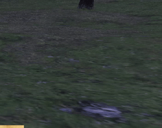

# Toasty!

## Overview
Toasty is an addon for Ashita v4, which displays toast notifications every time you pickup an item!
## Installation
1. Paste the addon into your addon folder in Ashita v4 installation.
2. Activate the addon with `/addon load toastynotif`
3. (optionally) Add `/addon load toastynotif` to configuration `scripts/default.txt` script

## Uninstallation
1. Simply delete the folder from your addon folder in Ashita v4 installation.
2. (optionally) If you added toasty to your configuration script, delete it from the file as well.

## Configuration
You can see available commands through `/toastynotif help`.

Settings window can be accessed through `/toastynotif settings`.

You can test your settings via `/toastynotif test`.

## Example

(click for a bigger vid with sound!)

## Planned features
- styling of the popup
- more?

## Acknowledgements
- [flux](https://github.com/rxi/flux/tree/master) - tweening library by rxi
- sound effects in `assets` - Square Enix, Bethesda, various hololive vtubers
